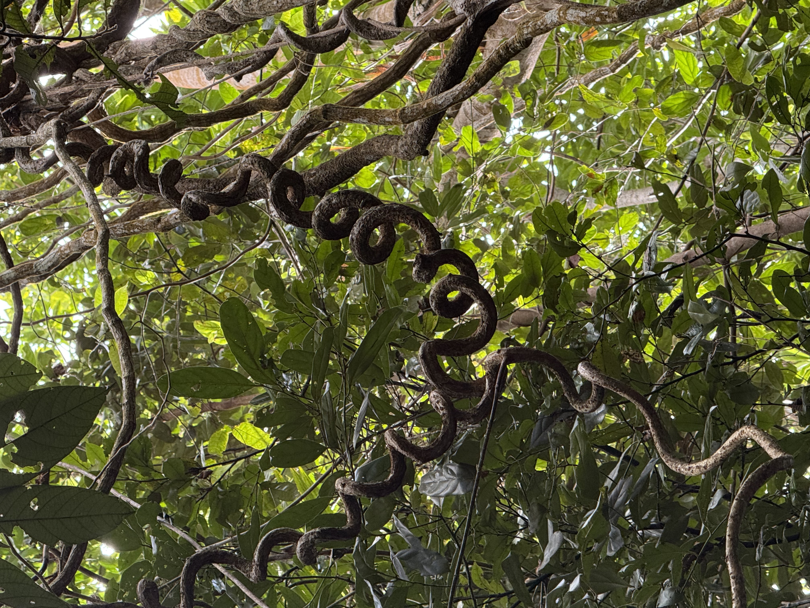

If you go to the Daintree Rainforest and don't seek out a strangler fig, can you really call yourself a software engineer? 

It's been a week since I got back from Far North Queensland, and I can't stop thinking about one particular vine.

In the rainforest, everything is competing for light. Some vines wrap themselves around branches, twisting and stretching upwards towards the canopy. They grow thicker over time, using the branch as their support.

But eventually, the branch dies and disappears.

The vine remains.

Still perfectly coiled around a branch that no longer exists.

It made me think about how many of our processes and systems look exactly like this.

They were built around a real constraint. They twisted and adapted to work around it. But when the constraint disappeared, the process stayed.

Then along comes automation or AI.

Instead of asking whether the process still makes sense, we spend enormous effort faithfully reproducing every twist and turn. We automate the coil.

That's why I believe the most valuable part of an AI or agentic transformation isn't the technology—it's questioning why the process exists in the first place.

Simplify. Reassess. Reimagine.

In the rainforest, the plants that reach the canopy fastest don't waste energy twisting around imaginary branches. They grow as directly towards the light as they can.

As you embark on your agentic journey, don't just replace what exists. Ask yourself why your vine is still coiled—and whether it's finally time to grow straight towards the light.
