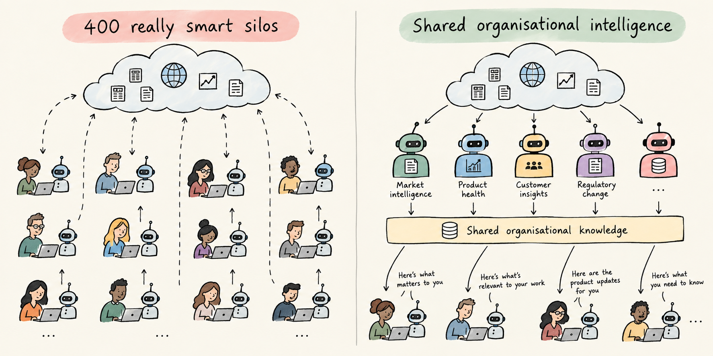

# From Personal Agents to Institutional Agents

I’ve been playing with Grokbot for the last few weeks. I originally got interested after hearing people talk about its focus on UX. I never went particularly close to OpenClaw, but the idea of agents moving beyond a chat window had me intrigued.

Since then, nearly all of the majors seem to be moving in a similar direction. The products themselves are interesting, but they've mostly had me thinking again about the **Orchestrate** phase of the **[Play → Share → Orchestrate](/writing/play-share-orchestrate)** AI value curve I wrote about recently.

I've been thinking about Orchestrate as the point where AI starts to move beyond the individual. Increasingly, I think that's the important bit.

Because giving everyone a really good personal agent doesn't necessarily make the organisation any smarter.

## 400 really smart silos

Imagine an organisation with 400 people, each with their own AI Chief of Staff. Every morning those 400 agents wake up, scan the internet, read industry news, look for competitor announcements, summarise changes in technology and prepare a briefing tailored to their human.

At an individual level, this sounds great. At an organisational level, I'm not so sure.

We've created 400 agents independently researching roughly the same world, interpreting it separately and storing what they learn inside 400 individual contexts. We've made each individual more capable, but we've also created 400 really smart silos.

And this is a problem we already know how to create without AI.

I'm currently dismayed by the amount of organisational knowledge I see travelling through email and DMs. Someone creates a useful document and sends it to six people. Worse, they attach the file rather than linking to a shared document, and immediately we've created multiple versions of the knowledge.

Now I'm increasingly seeing the AI version of the same behaviour. Someone creates something useful in Claude and shares the artifact. Honestly, the rise of the "shared Claude artifact" is doing my head in.

We've created something valuable, but rather than contributing it back into organisational knowledge, we've shared another isolated thing.

It would be unfortunate if we used incredibly powerful new technology to recreate the knowledge architecture we already know doesn't work.

## What if the agent belonged to the organisation?

Take the morning briefing example again. Instead of 400 personal agents independently researching the same landscape, imagine the organisation has a **Market Intelligence agent**.

It has a defined job. It continuously scans agreed sources, researches relevant developments, maintains provenance and contributes what it learns into a shared knowledge environment.

My personal Chief of Staff can then consume that organisational intelligence. But it doesn't need to give me the same briefing as everyone else. It knows what I'm working on, the decisions in front of me and what I'm interested in, so it can work out what is relevant to me.

Someone in Product might get something different. Someone in Strategy might see another angle. An engineer might not need to see that particular update at all.

This feels like a much more interesting architecture to me. Build shared organisational intelligence once, then personalise at the edge.

There are some obvious efficiencies in doing this. We don't need 400 agents burning tokens researching the same thing every morning. But that's probably the least interesting benefit.

More importantly, we're building organisational knowledge rather than 400 individual interpretations of it. We can establish provenance. People and agents can build on what has already been learned. And when someone leaves the organisation, the knowledge doesn't disappear with their personal context.

The pattern extends well beyond market intelligence.

A **Product Health agent** could continuously bring together customer behaviour, commercial performance, operational incidents and engineering signals to maintain a view of how a product is performing. Another might maintain an ongoing understanding of regulatory change. Another could continuously synthesise customer research.

These aren't really personal assistants anymore. They're shared organisational capabilities.

## When an experiment becomes infrastructure

I don't want this to mean that every useful agent needs to be centrally designed and governed from day one. In fact, I think that would destroy a lot of the value.

Experimentation should be incredibly cheap. People should be able to build an agent to solve something annoying, try an idea, share it with a colleague and throw it away if it doesn't work.

What we need is a sensing mechanism around that experimentation.

Maybe an agent starts being used repeatedly. Maybe people keep sharing it. Perhaps three teams independently build almost the same thing. Or an experiment starts becoming important to a business process.

Those are useful signals that something might be moving from an individual experiment to an institutional capability.

At that point, I think the rules should change.

The agent needs an owner. It needs defined consumers and a clear purpose. We need instrumentation and evaluation around whether it's actually effective. It needs product operations and a lifecycle.

In other words, **we start treating the agent as a product.**

This feels very similar to the shift we've been making with data. We don't want every team maintaining their own slightly different version of an important organisational dataset. When data becomes important enough, we treat it as a product: someone owns it, understands its consumers, measures its quality and is accountable for keeping it useful.

I think institutional agents will need much the same treatment.

## The agent isn't me

Promotion into an institutional capability also changes how I think about identity and security.

I don't think an institutional agent should simply inherit the permissions of whichever human happens to invoke it.

If I ask the Product Health agent a question, the agent isn't suddenly me. It should have its own identity and explicitly granted permissions based on what it needs to perform its role.

This becomes particularly important as agents move beyond retrieving information and start independently deciding which tools to invoke and which actions to take. I want to know what an agent is allowed to access, why it has that access, what it did and which humans or other agents consumed the result.

Principle of least privilege doesn't become less relevant because we've introduced agents. I suspect it becomes much more important.

## The fundamentals haven't gone anywhere

The more I think about this future, the more convinced I am that a lot of the less exciting work we've already been doing becomes even more important.

If organisational knowledge is scattered across inboxes, DMs, local files and people's heads, giving everyone an agent doesn't fix the knowledge architecture.

If data is inaccessible, poorly understood or difficult to consume, agents don't magically turn it into a good data architecture.

And if permissions are a mess, adding autonomous actors doesn't improve the situation.

Knowledge architecture, democratised data products, APIs, identity, security and observability become foundations for an agentic organisation.

The agents shouldn't become the place where those things live. They should be consumers and contributors to them.

## Orchestration is bigger than agents talking to agents

This is where my thinking about **[Play → Share → Orchestrate](/writing/play-share-orchestrate)** sits. I'm very interested in orchestration at an organisational level.

A personal Chief of Staff shouldn't need to know how to perform every function in the organisation. It needs to understand which institutional capabilities exist and how to work with them.

The Market Intelligence agent knows how to build market intelligence. The Product Health agent knows how to understand our products. My Chief of Staff knows me.

The interesting bit is how humans and agents work across that network together.

That's a very different picture of an AI-native organisation from one where everyone has a really good chatbot.

And treating agents as organisational products has led me to another question: **how long should those products actually live?**

My current thinking is probably much shorter than most enterprise technology teams would be comfortable with.

But that's the next post.