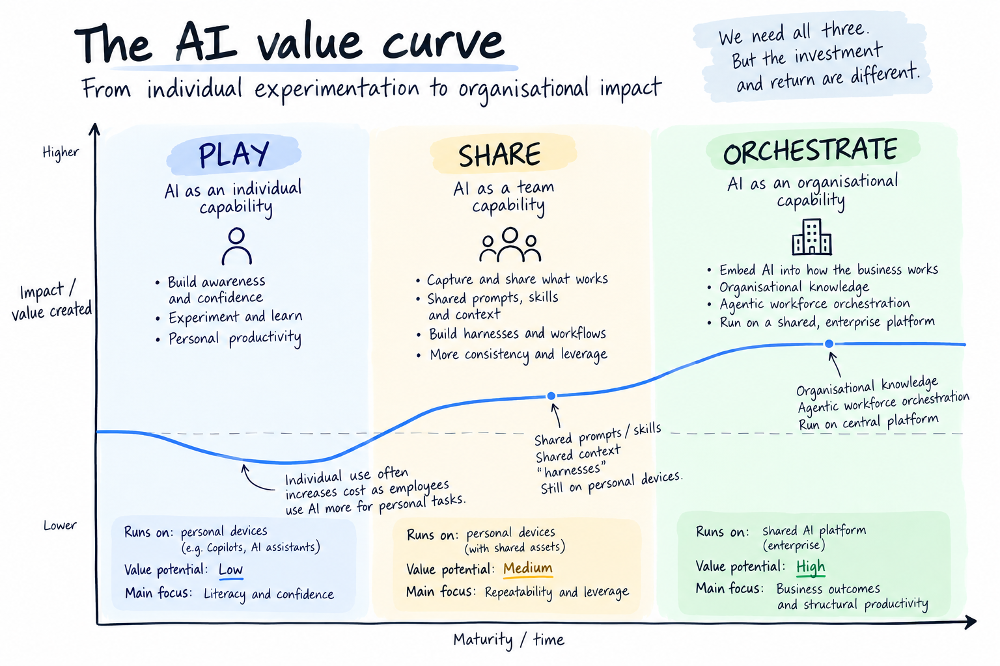

# AI Gets Interesting When It Leaves Your Laptop

I’m seeing a lot of focus at the moment on AI adoption.

Inside businesses, there are rollout plans, training programs and adoption targets. Outside them, my LinkedIn and YouTube feeds are full of advice on how to get personally better at using these tools.

The top 10 Claude prompts. How to build the perfect project. The best way to visualise something in ChatGPT. How to get more out of your AI assistant.

Even the model providers themselves understandably spend a lot of time teaching us how to make better use of their tools.

And I think this stage is necessary. People need to play. They need to build awareness of what these models can do, develop confidence using them and start to understand where they are genuinely useful.

But increasingly, my attention is somewhere else.

Because getting thousands of people individually better at using AI isn't the part I find most interesting.

**I'm much more interested in what happens when we stop thinking about AI as a tool used by individuals, and start thinking about it as a capability of the organisation itself.**

I've been drawing a picture lately to try to explain how I think about this. There are three quite different things happening at once.

## Play. Share. Orchestrate.

And while I think we need all three, the investment and value profile of each is very different.

### Play: AI as an individual capability

This is where most AI adoption programs are focused today. Give people access to the tools, teach them the basics and encourage them to experiment. Over time they learn which models are good at which things, develop their own ways of working and, importantly, build confidence in using AI.

I think this experimentation matters enormously. But the primary thing we're buying at this stage is **literacy, not transformation**.

There is also a slightly uncomfortable economic reality. As adoption grows, so does consumption. More licences, more tokens and more expensive models being used for more individual tasks. There will absolutely be productivity benefits along the way, but I'm not convinced thousands of individually saved minutes automatically add up to meaningful organisational value. If all we do is make individuals better at their existing work, we may find AI costs growing much faster than the value we can actually see.

That doesn't make Play a bad investment. It makes it a **building block rather than the destination**.

### Share: AI as a team capability

The next stage starts when we take what individuals are learning and make it reusable. Instead of everyone discovering their own way of working with AI, prompts become shared prompts, prompts become skills, and we start adding the context, instructions and workflows that capture how a team actually works.

Software engineering is a good example of where this is already happening. There is a big difference between giving every developer access to Claude and building an engineering harness around the model. The harness can contain the architecture patterns, engineering standards, testing expectations, tools and feedback loops that represent how *this team* builds software. Instead of every developer independently teaching the model how to work with them, we begin to encode the collective knowledge of the team.

This is where I think we start to see more meaningful leverage. What one person learns can benefit everyone, we get greater consistency and the capability starts becoming an asset rather than a personal productivity trick.

But there is still a ceiling. Much of this is still human initiated and, importantly, still running through tools on individual devices. Someone opens the tool, provides the intent and starts the work. We have created **shared intelligence, but it is still largely being consumed individually**.

And that distinction matters for what comes next.

### Orchestrate: AI as an organisational capability

The third stage is the one occupying most of my thinking at the moment.

What happens when the AI leaves the laptop and becomes part of the organisation itself?

Instead of AI being something each employee accesses, it runs on shared enterprise infrastructure. It has access to governed organisational knowledge, understands our products, policies and processes, and can interact with our systems. It has identity, permissions, guardrails and observability. Agents can work with systems, people and other agents to perform work across the organisation.

At that point the question changes from **"how can I use AI to do this task faster?"** to **"given humans and agents are both available to us, how should this work happen?"**

Think about a marketing campaign. At the individual level, AI might help someone write campaign copy. At the team level, shared skills, brand context and workflows allow the whole marketing team to work more effectively. But at the organisational level, we can start to imagine agents identifying an opportunity from customer data, developing audience segments, generating creative using organisational context, invoking compliance checks, coordinating approvals, launching experiments and monitoring the outcome.

Humans haven't disappeared from that system. But they also don't necessarily need to initiate and manually coordinate every step.

This is what I mean when I talk about an **agentic workforce**. Not a collection of AI assistants helping people work faster, but humans, agents and systems orchestrated around the work the organisation needs to perform.

And I think this is where the real economic opportunity of AI sits.

## The investment curves are different

The mistake would be to interpret these as three sequential maturity levels. I think organisations need to be operating across all three at the same time, because each one creates the conditions for the next.

Play builds the literacy and confidence that helps us discover where AI is useful. Share turns those discoveries into reusable capabilities and starts encoding organisational knowledge. Orchestrate takes those building blocks and uses them to rethink how work happens across the business.

But the reason we're investing in each is different, and so should be our expectation of return.

At the Play stage, I would optimise for broad participation at relatively low cost. At Share, I would invest selectively in the areas where team context and repeatability create meaningful leverage. At Orchestrate, I would be prepared to make much deeper investments in platforms, organisational knowledge, governance and agentic workflows because this is where we have the opportunity to fundamentally change the economics of the work.

This is why I'm wary when I see AI adoption becoming the headline measure of progress. An organisation could have thousands of people using AI every day, millions of prompts being generated and an enormous amount of enthusiasm, while remaining almost entirely in the first stage.

The models themselves are moving extraordinarily quickly. What feels difficult today may become a standard capability surprisingly soon.

So perhaps the more interesting question isn't how quickly we can get everyone using AI.

It's whether we're building an organisation capable of taking advantage of what comes next.

Because AI gets useful when we learn how to use it.

**But I think it gets really interesting when it leaves our laptops.**